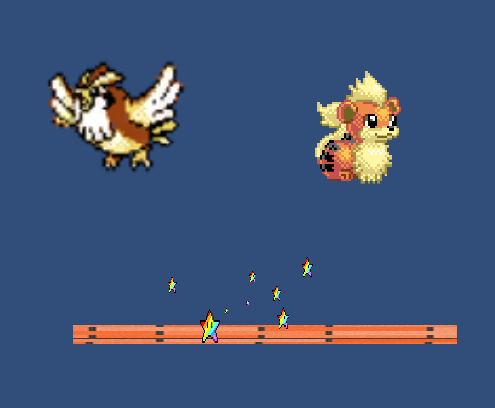
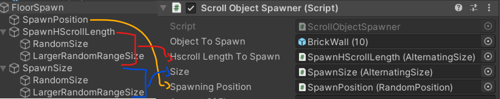
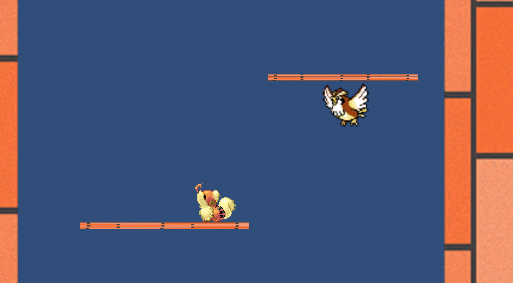

# IcyTower-like game, featuring Pokemons such as Growlith and Pidgy!
https://pikateam.itch.io/icytower-week6hm
## Keys:
- Movement: A and D
- Jump: W

## Goal:
GO higher in the floors and try not to be catched by the camera, if the camera catches you, the level is restarted.

## The player movement
- Player's speed is ramping up when moving in the same direction (up to a certain limit).
- There are 3 times of jumps:
    - Normal jump.
    - Normal jump + Acceleration: it takes the acceleration to do a higher jump! 
    - Momentum jump: while about to hit a floor in your way back, you can instantly jump again to gain even more effect on your acceleration speed ramp ups. (Stars show up!)

- Using RigidBody2D type of: Dynamic (movement is done by adding forces onto the body).

## The Camera
The camera is going upwards very slowly, makes you not to stay in one place forever, also the camera adjust the height of the maximum height the player reached and sets a new minimum height that the player shouldnt fall below it (out of the camera view).

## Left/Right walls/boundaries
The left and right boundaries are bouncable! the player can use them for his adventage.

- Using RigidBody2D type of: Static.

## Projectiles/Obstacles
Birds (Pidgy!) try to interrupts your jumps by blocking you, be careful!.
- Using RigidBody2D type of: Kinematic, without gravity, constant velocity.

## Levels
- Level 1
    - 15 Floors in total.
    - Floor sizes: Large-Very large.
    - Height between floors: Small-Very small.
- Level 2
    - 15 Floors in total.
    - Floor sizes: Medium-large.
    - Height between floors: medium-small.
    - BIRDS INCOMING! at rate: normal.
- Level 3
    - 15 Floors in total.
    - Floor sizes: Small-medium.
    - Height between floors: large-medium.
    - BIRDS INCOMING! at rate: higher.

Note: in each level, as the player go higher in floors, the sizes and height between floors changes, and gets harder, and not just between levels.

## Some Programming principles:
- Object composition (similar to Functional composition in Functional Programming).
    - Spawners (such as Bird Spawner and Floor Spawner) encapsulate few objects that determines thier behavior, such as Floor size and height between instantions on spawn, it makes the spawn object flexible as you can just swap the floor size behavior with some other, for example, we currrently use ConstantSize object, and RandomSize object, also there is an AlternatingSize that is composed of other ISize objects, (Similar to [TkFork](https://github.com/yegor256/takes/blob/bf432ebd10257cc94e31710fc944b377666c7459/src/main/java/org/takes/facets/fork/TkFork.java) of [Takes](https://github.com/yegor256/takes) library by [Yegor256](https://www.yegor256.com/) following the Elegant object principles)
    - Note that as Unity does not support very well Object composition as it does not work with constructors or interfaces (and all must implement MonoBehavior), The work around is to use GameObjects instead, Unity classifies classes and their intantces as Components, while GameObjects are purly Entities that are manipulated by Systems, following the [ECS-Architecture](https://en.wikipedia.org/wiki/Entity_component_system)]
    - links (examples): [ScrollObjectSpawner.cs](./Assets/Assets/Scripts/MonoComponents/ScrollObjectSpawner.cs)
    - Media:
    

## Some widely used techniques in unity:
- For ground collision detection use Physics2D.OverlapCircle, it gives flexible behavior and is more accurate than simple collisions.
- Unity Gizmos! (They are so cool).

## Known bugs:
- At level 1, if player falls and fails, for some reason the level is isnt restarted, and instead another level is loaded.
WIll be fixed in the future versions.

## Media

